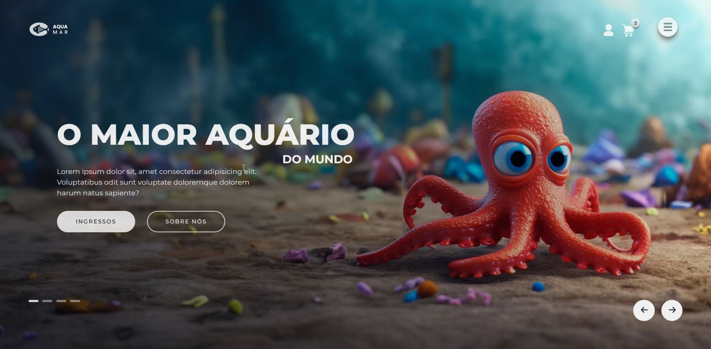

# 🐠 Slider Aquário


Projeto de estudo que consiste em uma página de aquário com um **slider (carrossel) de banners**. O objetivo foi praticar a construção de um slider do zero, com navegação por setas e indicadores (bullets), controlando o slide ativo com JavaScript.

🔗 **[🚀 Clique aqui para ver o projeto online](https://acali10.github.io/SliderAquario/)**
<!-- CONFIRMAR: o GitHub Pages precisa estar ativado em Settings > Pages para esse link funcionar. -->

---

## 📷 Demonstração



---

## ✨ Funcionalidades

- Slider com **4 slides**, exibindo um de cada vez.
- **Botões de navegação** (anterior e próximo) para trocar de slide.
- **Bullets** de navegação indicando a posição atual.
- **Header** com logo e ícones de usuário, carrinho e menu.
- Cada slide tem título, texto e dois botões de ação (**Ingressos** e **Sobre nós**).

---

## 🛠️ Tecnologias e Conceitos Aplicados

- **HTML5:** estrutura da página com `<header>`, sliders e navegação separados em blocos, e `aria-label` nos botões de seta para que leitores de tela identifiquem sua função.
- **CSS3:** estilização do layout, dos slides e dos botões primário e secundário (`.primaryButton` e `.secondaryButton`).
- **JavaScript:** controle do slide ativo por meio da classe `.active`, com a navegação pelos botões anterior/próximo e pelos bullets.
  <!-- CONFIRMAR: ajuste esta lista conforme o que você realmente usou no script.js (ex.: querySelectorAll, addEventListener, criação dos bullets via JS, etc.) e no style.css (ex.: Flexbox, transições, variáveis CSS, media queries). -->
- **Script com `defer`:** o `script.js` é carregado no `<head>` sem bloquear a renderização do HTML.

---


## 💻 Como rodar o projeto localmente

1. Clone o repositório:

```
git clone https://github.com/acali10/SliderAquario.git
```

2. Acesse a pasta do projeto:

```
cd SliderAquario
```

3. Abra o arquivo `index.html` em seu navegador.

---

## 🔜 Melhorias futuras

- Adicionar troca automática de slides (autoplay) com pausa ao passar o mouse.
- Permitir navegação pelo teclado e por gestos de arrastar (swipe) no mobile.
- Usar imagens e conteúdos diferentes em cada slide.
- Melhorar a acessibilidade (descrições nas imagens e anúncio da troca de slide para leitores de tela).

---

## 👤 Autora

Desenvolvido por Caline Nepomoceno:

- GitHub: [@acali10](https://github.com/acali10)